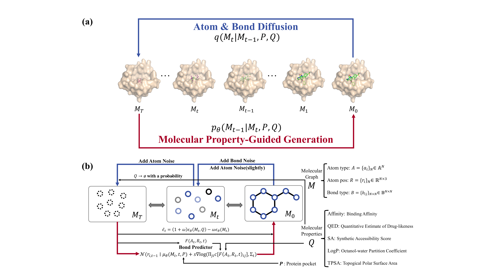

# Target-aware 3D Molecular Generation Based on Guided Equivariant Diffusion Model
Official implementation of ***DiffGui***, a guided diffusion model for de novo structure-based drug design and lead optimization, by Qiaoyu Hu, Changzhi Sun, JiaZheng Xu, Danlin Liu, Kang Zhang, and Honglin Li.

<p align="center">
   
</p>

## Installation

### Install conda environment via yaml file
```bash
# Create the environment
conda env create -f env.yml
# Activate the environment
conda activate diffgui
```

### Install Vina Docking
```bash
pip install meeko==0.1.dev3 scipy pdb2pqr vina==1.2.2
python -m pip install git+https://github.com/Valdes-Tresanco-MS/AutoDockTools_py3
```

### Install other required softwares
```bash
pip install diffusers==0.21.4 docutils==0.17.1 filelock==3.12.2 fsspec==2023.1.0
pip install softwares/torch_cluster-1.6.1+pt113cu116-cp37-cp37m-linux_x86_64.whl
pip install softwares/torch_scatter-2.1.1+pt113cu116-cp37-cp37m-linux_x86_64.whl
```
The package version should be changed according to your need.

## Datasets
The benchmark datasets utilized in this project, PDBbind and CrossDocked, are stored in the Google Drive [data](https://drive.google.com/drive/folders/1pQk1FASCnCLjYRd7yc17WfctoHR50s2r) folder.
### PDBbind
To train the model from scratch, you need to download the preprocessed lmdb file and split file:
* `PDBbind_v2020_pocket10_processed_final.lmdb`
* `PDBbind_pocket10_split.pt`

To process the dataset from scratch, you need to download PDBbind_v2020 from [here](https://drive.google.com/drive/folders/1pQk1FASCnCLjYRd7yc17WfctoHR50s2r), save it in `data`, unzip it, and run the following scripts in `data`:
* [clean_pdbbind.py](data/clean_pdbbind.py) will clean the original dataset, extract the binding affinity and calculate QED, SA, LogP, and TPSA of ligands. It will generate a `index.pkl` file and save it in `data/PDBbind_v2020` folder. *You don't need to do these steps if you have downloaded .lmdb file.*
    ```bash
    python clean_pdbbind.py --source PDBbind_v2020
    ```
* [extract_pockets.py](data/extract_pockets.py) will extract the pocket file from a 10 A region around the binding ligand in the original protein file.
    ```bash
    python extract_pockets.py --source PDBbind_v2020 --desti PDBbind_v2020_pocket10
    ```
* [split_dataset.py](data/split_dataset.py) will split the train, validation and test set.
    ```bash
    python split_dataset.py --path PDBbind_v2020_pocket10 --desti PDBbind_pocket10_split.pt --train 17327 --val 1825 --test 100
    ```

### CrossDocked
To train the model from scratch, you need to download the preprocessed lmdb file and split file:
* `crossdocked_v1.1_rmsd1.0_pocket10_processed_final.lmdb`
* `crossdocked_pocket10_pose_split.pt`

To process the dataset from scratch, you need to download CrossDocked2020 v1.1 from [here](https://bits.csb.pitt.edu/files/crossdock2020/), save it in `data`, unzip it, and run the following scripts in `data`:
* [clean_crossdocked.py](data/clean_crossdocked.py) will filter the original dataset and retain the poses with RMSD < 1 A. It will generate a `index.pkl` file and create a new directory containing the filtered data (corresponds to `crossdocked_v1.1_rmsd1.0.tar.gz` in the drive). *You don't need these files if you have downloaded .lmdb file.*
    ```bash
    python clean_crossdocked.py --source CrossDocked2020 --dest crossdocked_v1.1_rmsd1.0 --rmsd_thr 1.0
    ```
* [extract_pockets.py](data/extract_pockets.py) will extract the pocket file from a 10 A region around the binding ligand in the original protein file.
    ```bash
    python extract_pockets.py --source crossdocked_v1.1_rmsd1.0 --dest crossdocked_v1.1_rmsd1.0_pocket10
    ```
* [split_dataset.py](data/split_dataset.py) will split the training and test set. We use the split file `split_by_name.pt`, which can be downloaded in the Google Drive - data folder.
    ```bash
    python split_dataset.py --path data/crossdocked_v1.1_rmsd1.0_pocket10 --dest data/crossdocked_pocket10_pose_split.pt --fixed_split data/split_by_name.pt
    ```

## Training
### Trained model checkpoint
The trained model checkpoint files are stored in [here](https://drive.google.com/drive/folders/1pQk1FASCnCLjYRd7yc17WfctoHR50s2r).
* `pretrained.pt` is the checkpoint file pretrained on the CrossDocked dataset without labeling.
* `trained.pt` is the checkpoint file trained on the PDBbind dataset with labeling.
* `bond_trained.pt` is the checkpoint file of bond predictor trained on the PDBbind dataset. This should be used as guidance during sampling process.

### Training from scratch
```bash
python scripts/train.py --config configs/train/train.yml
```
If you want to resume the training, you need to revise the train.yml file. Set `resume` to True and set `resume_ckpt` to the checkpoint that you want to resume, eg. 100000.pt. In addition, `log_dir` should be defined by `args.logdir` (the previous training directory) instead of using `get_new_log_dir` function.

### Training bond predictor
```bash
python scripts/train_bond.py --config configs/train/train_bond.yml
```

## Inference
```bash
python scripts/sample.py --config configs/sample/sample.yml
```
The values of logp, tpsa, sa, qed, aff can be adjusted to generate molecules with desired properties.
* `logp` is octanol-water partition coefficient. It ranges from -2.0 to 5.0. High value indicates hydrophobicity and low value indicates hydrophilicity. The logp values of most drugs are located between 1.0 and 3.0.
* `tpsa` is topogical polar surface area. High value indicates high water solubility and low value indicates high lipid solubility. The tpsa values of most drugs are located between 20 and 60.
* `sa` is synthetic accessibility. It ranges from 0.0 to 10.0. The lower the sa value, the easier the organic synthesis. The reasonable sa values of most drugs are located between 0.0 and 5.0.
* `qed` is quantitative estimate of drug-likeness. It ranges from 0.0 to 1.0. 0.0 represents lowest drug-likeness and 1.0 represents highest drug-likeness.
* `aff` is binding affinity. It is calculated by -log10(Kd). High value indicates high binding affinity. For instance, 8.0 corresponds to 10 nM Kd.

### Sample molecules for given protein pocket
Revise the sample.yml file to sample molecules for any given protein pocket. Set `target` to pocket file (eg. sample/3ztx_pocket.pdb) and set `mode` to pocket.

### Sample molecules for all pockets in test set
Revise the sample.yml file to sample molecules for all pockets in test set. Set `target` to None and set `mode` to test.

### Sample molecules based on given fragments (lead optimization)
Revise the sample.yml file to sample molecules based on given fragments. Set `target` to pocket file (eg. sample/3ztx_pocket.pdb), set `frag` to fragment file (eg. sample/3ztx_frag.sdf), set `gen_mode` to frag_cond or frag_diff, and set `mode` to pocket.

